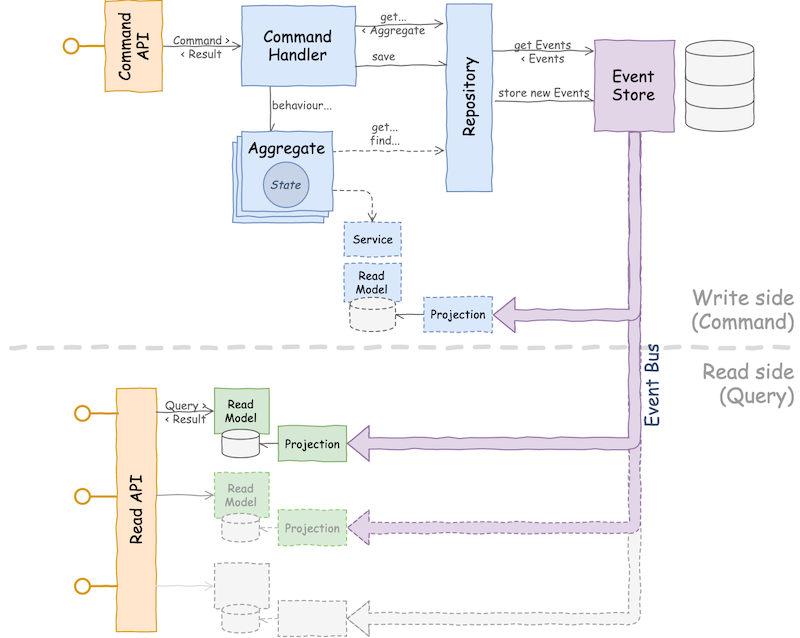

# Simple Event-Sourcing/CQRS example, in Kotlin

This project is for demonstration purposes.

It demonstrate a classing Event-Sourcing system and it is loosely based on [Greg Young's SimpleCQRS](https://github.com/gregoryyoung/m-r),
but with a different domain and additional features.

Differently from Greg Young's SimpleCQRS, the implementation is a bit more *functional* (still quite OOP),
avoiding for example to use Exceptions as signals and embracing immutability.
And it is obviously written in Kotlin rather than C# :)

## The Domain

The domain implemented is a training class management system.

Supported Commands are:

* Schedule New Class
* Register New Student
* Enroll a Student to a Class
* Unenroll a Student from a Class

Exposed Read Models:

* Student Details
* List of Students (this is implemented as a separate Read Model for demonstration purposes)
* List of Classes and Class Details, including contacts of enrolled Students

All Commands and Read Models are exposed as a REST API, notably following a
[REST-without-PUT](https://www.thoughtworks.com/insights/blog/rest-api-design-resource-modeling) approach for writed.
This fits well with CQRS.

No API documentation. Endpoints may be easily inferred looking at the [implementation of the API](src/main/kotlin/eventsourcing/api)

Some basic business rules (invariants) are enforced: not enrolling the same student twice, creating a class with no seats, not unenrolling a student never actually enrolled, do not register a student with an email already in use.

More business rules may be implemented, and also some non-idempotent side-effect, like sending a (fake) welcome email to a 
newly registered Student.

## The implementation

## The "C"-side

The Write side of the system supports a version-based concurrency control, to optimistically prevent from concurrent changes to an Aggregate.
Read Models provide the version of Aggregates and Commands contain the version of Aggregate they are expected to be applied to.

The Write side of the system is completely synchronous and blocking.

The Event Store is in-memory.

A simple Service has been included, maintaining an auxiliary Read Model, to enforce email uniqueness. This is a simplification that would not work in a real, distributed system.

## The "Q"-side

The Read side of the system implements multiple, independent Read Models. 
They run in-process but they are designed as if they where in separate applications (the only dependency to the Domain are the Events: for simplicity, they are not serialised when sent through the message bus).

The message bus is in-memory, but asynchronous.
Read Models are updated asynchronously and only eventually consistent with the state of the Aggregates on the Write side, to behave similarly to a real, distributed CQRS system. 
Though, in this case, latency is negligible (but it is possible to simulate an higher latency!).

"Datastores" backing Read Models are also in-memory.

### Why Arrow?

[Arrow](https://arrow-kt.io) Kotlin functional library is used only for 
[`Either`](https://arrow-kt.io/docs/apidocs/arrow-core-data/arrow.core/-either/index.html), 
[`Option`](https://arrow-kt.io/docs/apidocs/arrow-core-data/arrow.core/-option/index.html) and few other bits, to allow
nicer patterns compared to Kotlin native constructs.

The code is far from purely functional.

### Why SpringBoot?

Because I am lazy ;) and I do not want to spend time on the boilerplate. My focus here is different
Spring is not actually used much other than the REST API layer and for running some E2E in-process tests.
All dependencies are initialised and wired manually in [`Application`](src/main/kotlin/eventsourcing/Application.kt)

### Other implementation notes

To allow mocking non-open classes, the Mockito `mock-maker-inline` has been enabled. See https://antonioleiva.com/mockito-2-kotlin/
